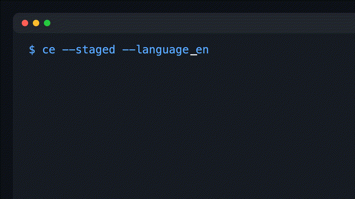

# Change Evidence

[English](README.md) | 简体中文

<h1 align="center">🔍 Change Evidence</h1>
<p align="center">
  <b>AI 编码后，提交前 3 秒看清代码风险</b><br>
  AI 辅助代码变更的提交前风险摘要工具
</p>

[](https://github.com/qcodingdev/change-evidence/actions/workflows/ci.yml)

AI coding 后，在 commit 前快速看清本地代码改动风险。



Change Evidence 是一个本地优先、CLI-first 的提交前风险摘要工具。它适合在 AI coding 工具一次修改大量文件后使用：你可以在提交前看到精简的终端报告，了解改了哪些区域、命中了哪些风险信号、提交前还需要检查什么。

它不判断代码正确性，风险分析不联网，不修代码，不回滚，不批准提交，不创建 PR，也不会上传你的代码。它只读取本地 git diff，并输出克制的风险摘要。只有用户主动执行 `ce update` 时才会通过 npm 下载更新。

## 为什么需要 Change Evidence？
你用 Cursor / Claude Code / Copilot 生成了 20 个文件，准备 git commit —— 但有没有混入敏感密钥？测试补了吗？生产配置改了吗？

Change Evidence 在每次提交前打印一份精简的风险报告，帮你避免：

🔑 密钥泄露 —— 误提交 token、密码、API key

🧪 测试缺失 —— 改了生产代码却忘了写测试

📦 配置漂移 —— 依赖或基础设施变更未检查

🚨 高风险路径 —— auth、payment、database 等核心区域被意外改动


## 安装

需要 Node.js 20+ 和 `git`。

```bash
npm install -g change-evidence
```

npm 安装完成后，Change Evidence 会提示下一步：进入某个 git 仓库后执行 `ce install-hook`，即可启用自动提交前检查。

也可以使用一行安装脚本：

```bash
curl -fsSL https://raw.githubusercontent.com/qcodingdev/change-evidence/main/install.sh | sh
```

安装脚本会通过 npm 全局安装 CLI。如果你在 git 仓库中运行，它会进入可选 hook 配置流程：先选择输出语言，再选择是否安装 hook，然后选择模式和触发阈值。如果你在非 git 仓库目录运行，它只会安装全局 CLI；之后需要进入项目目录执行 `ce install-hook` 来配置语言和自动提交前检查。Hook 不会被静默安装或强制启用。

如果只是从源码仓库本地试用：

```bash
npm install
npm run build
npm install -g .
```

## 使用

Change Evidence 提供两个等价命令：

- `ce`
- `change-evidence`

日常建议使用短命令 `ce`：

```bash
# 分析暂存区改动，提交前最常用
ce --staged

# 分析未暂存的工作区改动
ce

# 分析当前分支相对 main 的差异
ce --base main
```

## 命令

| 命令 | 说明 |
|---|---|
| `ce` | 使用 `git diff` 分析工作区改动 |
| `ce --staged` | 使用 `git diff --cached` 分析暂存区改动 |
| `ce --base main` | 分析 `git diff main...HEAD` |
| `ce --language en` | 输出英文报告 |
| `ce --language zh-CN` | 输出中文报告 |
| `ce --no-color` | 关闭终端颜色 |
| `ce install-hook` | 安装可选 pre-commit hook |
| `ce install-hook --force` | 覆盖已有的非本工具管理的 pre-commit hook |
| `ce uninstall-hook` | 从当前仓库移除本工具管理的 pre-commit hook |
| `ce hook install` | `ce install-hook` 的别名 |
| `ce hook uninstall` | `ce uninstall-hook` 的别名 |
| `ce update` | 通过 npm 更新全局安装的 CLI |
| `ce uninstall` | 确认后移除当前仓库 Hook，并全局卸载 CLI |
| `ce uninstall --yes` | 明确接受影响后，在非交互环境直接卸载 |

## 输出示例

```text
Change Evidence 代码变更证据包

范围：暂存区改动    风险等级：高风险

摘要
- 变更文件：12
- 新增行数：326
- 删除行数：48
- 生产代码文件：7
- 测试文件：0
- 高风险文件：3

高风险变更
[HIGH] src/auth/AuthService.ts
  命中高风险路径；公开 API 变更

风险信号
[HIGH] 检测到敏感关键词：token, password
[WARN] 生产代码有变更，但没有测试文件变更

提交前建议
[ ] 确认没有误提交真实密钥
[ ] 为改动过的生产代码补充或更新测试
```

## 检测内容

Change Evidence 基于本地 git diff 和确定性规则工作，不需要 LLM。

- 高风险路径：`auth`、`security`、`payment`、`migration`、`database`、`config`、CI/CD workflow、`.env*`、`Dockerfile`、`application.yml`、`package.json`、`pom.xml`、`build.gradle`
- 测试信号：生产代码变更但测试未变、关键区域变更但无测试、测试文件被删除
- 大改动信号：文件数过多、总行数过多、单文件改动过大
- 配置、依赖、数据库迁移、CI/CD 变更
- 敏感关键词：`token`、`secret`、`password`、`private_key`、`api_key`、`access_key`、`authorization`
- 公开 API 信号：TypeScript/JavaScript export、Java public 方法、Spring route mapping、`/api/` 和 `/routes/` 改动

疑似 secret 的值会在报告渲染前被脱敏。报告可能提示命中的关键词，但不会打印 secret 值。

## 配置

在仓库中创建 `.change-evidence.yml`：

```yaml
language: zh-CN # zh-CN | en

risk:
  highPaths:
    - "**/auth/**"
    - "**/security/**"
    - "**/payment/**"
    - "**/migration/**"
    - "**/database/**"
    - "**/config/**"
    - ".github/workflows/**"
    - "**/application.yml"
    - "**/application.yaml"
    - ".env*"
    - "Dockerfile"
    - "pom.xml"
    - "package.json"
    - "build.gradle"
  sensitiveKeywords:
    - token
    - secret
    - password
    - private_key
    - api_key
    - access_key
    - authorization
  sizeThresholds:
    maxFiles: 10
    maxTotalLines: 500
    maxSingleFileLines: 200

report:
  maxFiles: 20
  maxRiskItems: 10
  maxChecklistItems: 8
  collapseLowRisk: true

hook:
  enabled: true
  mode: prompt # off | report | prompt | block
  trigger:
    minChangedFiles: 10
    minRiskLevel: medium # ok | low | medium | high
```

非法配置会被忽略，并回退到默认值。

## Pre-commit Hook

在 git 仓库内安装可选 hook：

```bash
ce install-hook
```

安装器会询问：

- 输出语言
- 是否安装 hook
- hook 模式
- 触发阈值

它会在 Git 实际使用的 hooks 目录（包括 `core.hooksPath`）写入一个由 Change Evidence 管理的 `pre-commit` 脚本，并把你的选择保存到 `.change-evidence.yml`。

Hook 按仓库生效。在一个项目里安装 hook，不会影响其他项目。如果 IDE 走标准 git hooks 流程提交，例如 IntelliJ IDEA 默认的 Git commit 流程，也会触发该 hook。使用 `--no-verify` 或 IDE 中跳过 hooks 的设置时不会触发。

Hook 模式：

| 模式 | 行为 |
|---|---|
| `off` | 不自动运行 |
| `report` | 打印报告并继续提交 |
| `prompt` | 命中触发规则时询问是否继续；无可交互终端时中止提交 |
| `block` | 仅在高风险触发规则命中时阻止提交 |

触发规则同时使用变更文件数和总体风险等级。已有的非 Change Evidence 管理的 pre-commit hook 会被保留，除非传入 `--force`。

从当前仓库卸载 hook：

```bash
ce uninstall-hook
```

卸载默认是安全的：只会删除 Change Evidence 自己写入的 hook，不会删除用户自定义 hook。

## 更新与卸载

通过 npm 更新全局安装的 CLI：

```bash
ce update
```

移除当前仓库 Hook，并全局卸载 CLI：

```bash
ce uninstall
```

该命令会先要求确认，只删除当前仓库中由 Change Evidence 管理的 Hook，保留自定义 Hook，然后执行 npm 全局卸载。非交互环境默认拒绝卸载，必须明确接受影响：

```bash
ce uninstall --yes
```

Change Evidence 无法安全扫描机器上的所有代码仓库。如果多个仓库安装过 Hook，应在最终全局卸载前逐个清理：

```bash
cd /path/to/another/repository
ce uninstall-hook
```

也可以继续使用等价的 npm 手动卸载命令：

```bash
npm uninstall -g change-evidence
```

## 隐私

Change Evidence 的风险分析完全在本地运行。它调用 `git diff`，在当前进程中分析输出，然后打印终端报告。它不会把代码、diff 或 secret 发送到远程服务。只有 `ce update` 等用户主动执行的包管理操作会调用 npm，并可能访问当前配置的 npm registry。

## 贡献

欢迎贡献代码。提交 pull request 前请先阅读 [CONTRIBUTING.md](CONTRIBUTING.md)。

安全问题请阅读 [SECURITY.md](SECURITY.md)。请不要在公开 issue 中粘贴真实 secret、凭证或私有代码。

## 开发

```bash
npm install
npm run typecheck
npm test
npm run build
```

常用本地命令：

```bash
npm run dev -- --staged
node dist/cli/index.js --staged --no-color
```

## 作者

由 QCoding 创建。

QCoding｜专注 AI 应用开发与 Java 技术实践。

## 许可证

MIT
